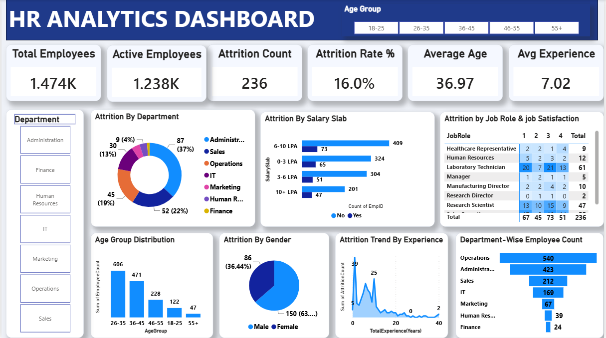

# 📊 HR Analytics Dashboard

An interactive **HR Analytics Dashboard built with Microsoft Power BI** to analyze employee data and understand workforce trends, attrition, salary distribution, demographics, job roles, and employee experience.

## 📌 Project Overview

This project presents an interactive HR Analytics Dashboard designed to provide a clear overview of employee-related metrics and attrition patterns.

The dashboard allows users to explore HR data using department filters and age-group filters. It provides important KPIs and visualizations that help understand employee distribution, attrition, salary slabs, job roles, gender, age groups, and experience.

## 🎯 Objectives

- Analyze overall employee data
- Monitor employee attrition
- Understand department-wise employee distribution
- Analyze attrition by department and salary slab
- Study employee distribution by age group and gender
- Analyze job roles and job satisfaction
- Understand attrition trends based on experience
- Present HR insights through an interactive dashboard

## 🛠️ Tools & Technologies

- **Microsoft Power BI**
- **Power Query**
- **DAX**
- **Microsoft Excel**
- **Data Visualization**

## 📊 Dashboard KPIs

The dashboard displays the following key metrics:

| KPI | Value |
|---|---:|
| Total Employees | 1.47K |
| Active Employees | 1.238K |
| Attrition Count | 236 |
| Attrition Rate | 16.0% |
| Average Age | 36.97 |
| Average Experience | 7.02 Years |

## 📈 Dashboard Visualizations

The dashboard contains the following visualizations:

- **Attrition by Department**
- **Attrition by Salary Slab**
- **Attrition by Job Role & Job Satisfaction**
- **Age Group Distribution**
- **Attrition by Gender**
- **Attrition Trend by Experience**
- **Department-wise Employee Count**

## 🔎 Dashboard Filters

The dashboard includes interactive filters for:

- Department
- Age Group

These filters allow users to dynamically explore different segments of the employee dataset.

## 💡 Key Insights

The dashboard can be used to identify:

- Departments with higher employee attrition
- Salary ranges associated with employee attrition
- Job roles with higher employee turnover
- Employee distribution across different age groups
- Gender-wise attrition patterns
- Experience levels associated with attrition
- Departments with the highest number of employees

## 📷 Dashboard Preview



## 📁 Project Structure

```text
HR-Analytics-Dashboard/
│
├── Dashboard/
│   └── HR_Analytics_Dashboard.pbix
│
├── Images/
│   └── dashboard.png
│
└── README.md
